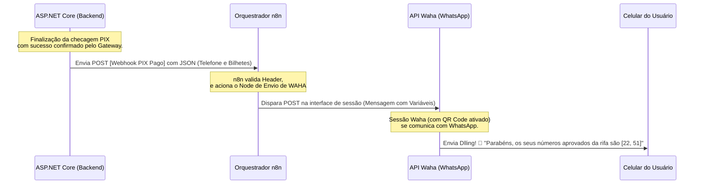

# 🤖 Automações RifaHub: Orquestrador n8n e Mensageria


Infraestrutura em nuvem e automação inteligente que silenciosamente gerencia a magia de envios via WhatsApp para o Sistema de Rifas, conectando o painel N8N com a engine API Waha.

[]()
[]()

## 📒 Index
- [🔰 About](#-about)
- [⚡ Usage](#-usage)
  - [🔌 Installation](#-installation)
  - [📦 Commands](#-commands)
- [🔧 Development](#-development)
  - [📓 Pre-Requisites](#-pre-requisites)
  - [🔩 Development Environment](#-development-environment)
  - [📁 File Structure](#-file-structure)
  - [🔨 Build](#-build)
  - [🚀 Deployment](#-deployment)
- [🌸 Community](#-community)
- [❓ FAQ](#-faq)
- [📄 Resources](#-resources)
- [📷 Gallery](#-gallery)
- [🌟 Credit/Acknowledgment](#-credit-acknowledgment)
- [🔒 License](#-license)

## 🔰 About
Bem-vinda(o) à infraestrutura que é a magia silenciada do nosso projeto. Como se não bastasse uma API robusta escalonando tramas, integramos num pilar apartado os ecossistemas do WhatsApp com Webhooks dinâmicos com a maior transparência logística possível.

Toda a nossa comunicação transacional por trás atua através do ecossistema do Docker. Aqui, temos nós complexos para garantir que os números de sorteio de sua rifa caiam perfeitamente na mão do comprador via Whatsapp, automatizando fluxos engessados de suporte e engajamento.

O nosso fluxo funciona em "Corrente de Efeitos Cascata":



## ⚡ Usage
O ambiente é orquestrado quase magicamente, mas precisa ser invocado antes de ser consumido pela sua API.

### 🔌 Installation
Subir o stack deste ecossistema em Docker abrigará:
1. **O Porteiro e Estoquista (PostgreSQL)**: Servindo para sessões locais do N8N e base externa transacional da API principal (Via porta `5445`).
2. **O Carteiro Assíncrono (Redis)**: Para gerenciar Rate-Limiting.
3. **A Máquina Digital (Waha)**: A API gratuita baseada em Engine WEBJS integrando o WhatsappWeb.
4. **O Orquestrador Lógico (n8n)**: Plataforma _Low-Code_.

### 📦 Commands
Para interagir com as imagens do Docker, os principais comandos são:
```bash
# Iniciar as instâncias em background livre
docker-compose up -d

# Derrubar e destruir a rede local
docker-compose down

# Ler os logs em tempo real das automações e mensagens
docker-compose logs -f
```

## 🔧 Development
### 📓 Pre-Requisites
- Docker Desktop / Docker Engine -> `docker -v`
- Docker Compose.
- Um celular base com WhatsApp funcional logado.

### 🔩 Development Environment
Navegue até o diretório raiz deste módulo (`rifa-n8n`), e certifique-se que o Docker Daemon está correndo no sistema. Use o comando `docker-compose up -d`.

### 📁 File Structure
```
.
├── compose.yaml          # Receita global de containers (N8n, Waha, Postgres, Redis)
└── README.md
```

### 🔨 Build
Não há um processo de compilação C# ou JS aqui, toda a "compilação" ocorre baseada no pull das imagens públicas listadas no arquivo e na linkagem das redes inter-containers através do Docker.

### 🚀 Deployment
Para deploy na nuvem, recomenda-se provisionar estas instâncias exatamente num container runner (como ECS, Railway ou Koyeb). Ao enviar pra Produção, lembre-se de atualizar as travas de `WAHA_API_KEY` para as envvars sigilosas da máquina hospedeira.

## 🌸 Community
Projetado individualmente visando a estabilidade transacional, não há regras agressivas de branch ainda. Sinta-se a vontade para dar forks ou abrir PRs no ecossistema global.

## ❓ FAQ
**Como obtenho a URL do Webhook do n8n para plugar no C#?**
Acesse localmente `http://localhost:5678`. Lá dentro, desenhe seu Webhook, copie o endpoint em formato de Teste ou Produção, e isso que colará no seu backend API.

**Onde escaneio o QR Code do Waha?**
Pelo seu painel em `http://localhost:3000` via rotas de Swagger API em `/sessions`.

## 📄 Resources
- [Documentação Oficial Waha](https://waha.devlikeapro.com/)
- [N8N Docs](https://docs.n8n.io/)

## 📷 Gallery
*(Aqui viria um print da interface do fluxo do n8n ativado)*

## 🌟 Credit/Acknowledgment
Autor original e modelador da infraestrutura lógica do RaffleHub n8n Automation.

## 🔒 License
Sistema Fechado. Uso Autorizado. Todos os Direitos Reservados para sua Rifa Comercial.
