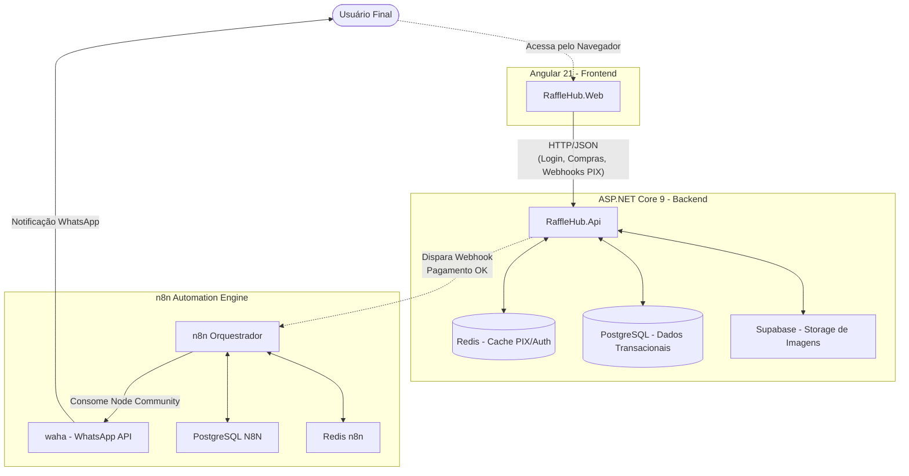

# 🎟️ Sistema de Rifas Digital - Visão Global e Arquitetura

Ecossistema unificado para gestão de Rifas virtuais em tempo real, abrangendo Pagamentos, Reservas dinâmicas e Conclamação de Prêmios via Automação de WhatsApp.

## 📒 Index
- [🔰 About](#-about)
- [⚡ Usage](#-usage)
  - [🔌 Installation](#-installation)
  - [📦 Commands](#-commands)
- [🔧 Development](#-development)
  - [📓 Pre-Requisites](#-pre-requisites)
  - [🔩 Development Environment](#-development-environment)
  - [📁 File Structure](#-file-structure)
  - [🔨 Build](#-build)
  - [🚀 Deployment](#-deployment)
- [🌸 Community](#-community)
- [❓ FAQ](#-faq)
- [📄 Resources](#-resources)
- [📷 Gallery](#-gallery)
- [🌟 Credit/Acknowledgment](#-credit-acknowledgment)
- [🔒 License](#-license)


## 🔰 About
Bem-vinda(o) à centralização do Sistema de Rifas! Este repostiório engloba toda a mágica micro-serviçada. O sistema aproxima as peças de software à operação de um restaurante:
- O **Frontend** (`rifa-frontend`) atua como Menu vivo interativo.
- O **Backend** (`rifa-backend`) é a cozinha em si, onde ingredientes (Pedidos PIX) tornam-se Pratos (Tickets registrados).
- A **Automação** (`rifa-n8n`) é a frota do delivery, despachando via Waha.

### Flowchart Arquitetural



## ⚡ Usage
É um projeto divido de modo modular em três repositórios independentes amarrados a este contêiner Root.

### 🔌 Installation
Por serem desacoplados, a instalação varia na linguagem mestre.

### 📦 Commands
A ordem universal para erguer o ecossistema mental e virtual a partir dos terminais no seu computador é a seguinte:
1. Navegue e Inicie os `docker-compose up -d` da infraestrutura no n8n.
2. Atualize localmente com `dotnet run` as bases relacionais atreladas no folder `backend`.
3. Erga o Live Server do Node via `npm start` no `frontend/` com porta `4200`.

## 🔧 Development
### 📓 Pre-Requisites
O seu computador deve ser provido dos ambientes em Cloud das três ferramentas:
- Docker Manager (Essencial para os serviços orquestradores).
- SDK .NET v9 Integral.
- Ferramental Node JavaScript.

### 🔩 Development Environment
Não existe um "Run de Projeto Root". Você entra em cada *Environment* conforme listado em File Structure.

### 📁 File Structure
```
.
├── rifa-backend         # Pasta base do Monolito Lógico em ASP.NET Core
├── rifa-frontend        # Pasta Base da UI SPA em Angular 21
├── rifa-n8n             # Pasta com Stack YAML Engine Waha/N8N
└── README.md
```

### 🔨 Build
Consultar README dos módulos isolados para gerar Build Release de sua DockerImage C# e a Pasta `Dist/` Angular.

### 🚀 Deployment
Integramos a pipeline com Clouds ágeis como Koyeb API onde as Envs vars globais atuam unidas sobre a persistência dos clusters Postgre. 

## 🌸 Community
Você pode sugerir extensões no fluxo. Leia os repositório em suas lógicas subjacentes.

## ❓ FAQ
**Esse repositório possui submódulos GIT?**
Idealmente podem geridos dessa maneira ou estarem presentes fisicamente durante desenvolvimento local isolado para evitar confusões de Merge entre Front e Back.

## 📄 Resources
Todos alocados dentro de seus respectivos *readmes*.

## 📷 Gallery
*(Aqui será o Mockup geral da tela de login atrelada ao celular rodando whatsapp)*

## 🌟 Credit/Acknowledgment
Aos arquitetos modernos de SPA vs WebAPI.

## 🔒 License
Sistema de Negócios e Ecommerce particular em Pleno Vigor. Uso reservado à Proprietária.
