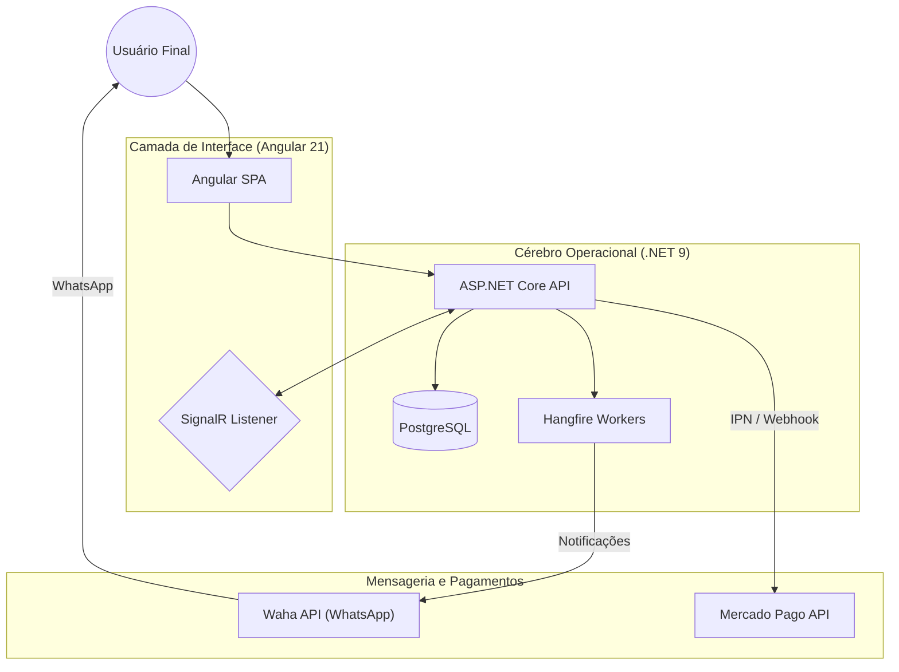

# 🎟️ RaffleHub - Ecossistema Digital de Rifas de Alta Performance

> [!TIP]
> **Metáfora do Sistema: "A Cozinha Digital Sincronizada"**
> - **O Salão (Frontend):** Interface reativa em Angular 21. O cliente escolhe seus bilhetes com feedback instantâneo via Signals e SignalR.
> - **A Cozinha (Backend):** O motor em .NET 9 que processa pedidos, valida dados com o Result Pattern e garante a persistência no PostgreSQL.
> - **O Delivery (Integrações):** Pagamentos via Mercado Pago e notificações via WhatsApp (WAHA) garantem que o bilhete chegue ao cliente logo após a confirmação.

---

## 🚀 Visão Geral e Arquitetura

O **RaffleHub** é uma solução *Full Stack* desacoplada, projetada para gerenciar rifas virtuais com zero concorrência e notificações em tempo real. A arquitetura foi pensada para resiliência: se um componente falha, o restante do sistema permanece íntegro.

### 🏗️ O Mapa da Mina (Fluxo de Dados)

---

## ⚡ Fluxo Principal (The Golden Path)

1. **Seleção:** O usuário escolhe os números na interface. O **SignalR** trava os números selecionados para outros usuários em tempo real.
2. **Reserva:** A API valida a reserva e cria o registro pendente no **PostgreSQL**.
3. **Pagamento:** Integração direta com **Mercado Pago** para gerar um Pix dinâmico.
4. **Confirmação:** Ao receber o webhook de pagamento, a API marca a reserva como `PAID`.
5. **Notificação:** O **Hangfire** dispara uma tarefa em background para enviar o comprovante via WhatsApp automaticamente.

---

## 🎯 Requisitos Funcionais Implementados

- **Gestão de Rifas:** CRUD completo com controle de status e upload de imagens.
- **Reservas Atômicas:** Travamento de bilhetes para evitar venda dupla (*Race Conditions*).
- **Checkout com Pix:** Geração automática de pagamentos via Mercado Pago.
- **Área do Participante:** Consulta de reservas e acompanhamento de status.
- **Confirmação Automática:** Webhooks para processamento imediato de pagamentos.
- **Notificações Automatizadas:** Envio de bilhetes via WhatsApp pós-pagamento.
- **Galeria de Ganhadores:** Espaço para divulgação de resultados e fotos.

---

## 🏆 Qualidade e Boas Práticas

- **Backend:** Clean Architecture, Dependency Injection, Result Pattern (FluentResults), DTOs imutáveis, Middleware global de erros.
- **Frontend:** Angular Signals, Standalone Components, Validação com Zod, RxJS para fluxos assíncronos, Tailwind CSS.
- **DevOps:** Preparado para Docker, logs estruturados com Serilog.

---

## 📦 Como Navegar neste Repositório

Este repositório agrupa os dois pilares do sistema:
- [rifa-backend](README-backend.md): A inteligência e persistência (C#/.NET).
- [rifa-frontend](README-frontend.md): A experiência do usuário (Angular 21).

---
> [!IMPORTANT]
> Desenvolvido por **Suelen** como um laboratório de engenharia moderna, aplicando conceitos de escalabilidade e fundamentos de alta performance.
