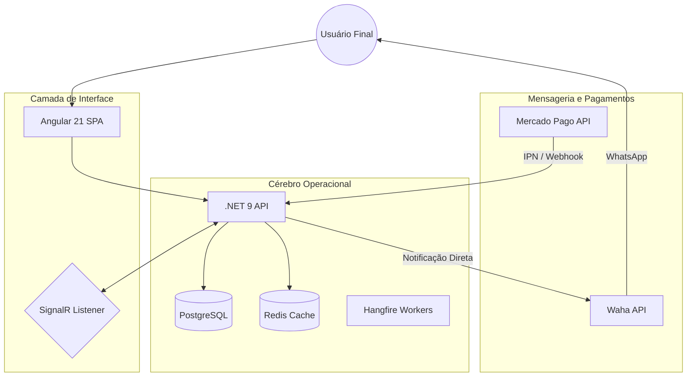

# 🎟️ RaffleHub - Ecossistema Digital de Rifas de Alta Performance

> [!TIP]
> **Metáfora do Sistema:** O RaffleHub opera como uma "Cozinha Digital" sincronizada:
> - **O Menu (Frontend):** Interface reativa em Angular 21, onde o cliente escolhe seu "prato" (bilhete) com feedback visual instantâneo via Signals.
> - **A Cozinha (Backend):** O motor lógico em .NET 9 que processa pedidos, valida ingredientes (dados) e mantém a integridade da despensa (DB).
> - **A Entrega (WhatsApp):** O sistema de mensageria que envia o comprovante diretamente no WhatsApp do cliente via integração direta com WAHA.

---

## 🚀 Visão Geral e Arquitetura

O **RaffleHub** é uma solução *Full Stack* desacoplada, projetada para gerenciar rifas virtuais com zero concorrência e notificações em tempo real. A arquitetura foi pensada para resiliência: se um componente falha, o restante do sistema permanece íntegro.

### 🏗️ O Mapa da Mina (Fluxo de Dados)

---

## ⚡ Fluxo de Vida de uma Reserva (The Golden Path)

1. **Seleção:** O usuário escolhe os números. O **SignalR** trava os números selecionados para outros usuários em milissegundos.
2. **Registro:** A API valida os dados via **FluentValidation** e cria uma reserva pendente no **PostgreSQL**.
3. **Pagamento:** O sistema integra com **Mercado Pago** para gerar um PIX dinâmico personalizado.
4. **Confirmação:** Ao receber o webhook de pagamento, a API marca a reserva como `PAID`.
5. **Notificação:** O sistema utiliza o **WAHA** para enviar o comprovante via WhatsApp automaticamente após a confirmação do pagamento.

---

## 🛠️ Stack Tecnológica Enterprise

| Camada | Tecnologia | Propósito |
| :--- | :--- | :--- |
| **Frontend** | Angular 21 | Interface reativa com Signals e Standalone Components. |
| **Backend** | .NET 9 | API robusta com Clean Architecture e Result Pattern. |
| **Real-time** | SignalR | Sincronização instantânea de estado entre clientes. |
| **Workers** | Hangfire | Processamento de tarefas em background e agendamentos. |
| **Mensageria** | Waha | Gateway profissional de WhatsApp. |
| **Logs** | Serilog + Seq | Observabilidade e rastreamento de erros centralizado. |

---

## ✨ Demonstração Visual

<carousel>

<!-- slide -->

<!-- slide -->

</carousel>

---

## 📦 Como Navegar neste Repositório

Este é um mono-repositório contêiner que agrupa os três pilares do sistema:
- [rifa-backend](file:///home/suelen/Documents/Baja/rifas/rifas/rifa-backend/README-backend.md): A inteligência e persistência.
- [rifa-frontend](file:///home/suelen/Documents/Baja/rifas/rifas/rifa-frontend/README-frontend.md): A experiência do usuário.

---

## 👤 Autora e Arquiteta

**Suelen** - *Full Stack Developer & Systems Architect.*
Este projeto é meu laboratório de engenharia moderna, onde aplico padrões de alta escalabilidade e o conceito de **Segundo Cérebro** para documentação e aprendizado contínuo.

---
> [!IMPORTANT]
> O uso deste código é estritamente privado. Para licenciamento ou consultas sobre a arquitetura, entre em contato.
